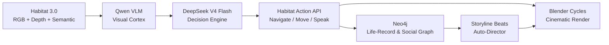

# lifeworld

**Autonomous SMPL-X humanoid NPCs that live lives.**

Agents perceive a simulated 3D world (Habitat 3.0), decide via DeepSeek V4 Flash, remember in a Neo4j graph, and get rendered cinematically in Blender. Two subsystems: **lifeworld** (NPC simulation) and **docupipe** (documentary production pipeline).

[](LICENSE)

## What it does



1. **Perceive** — SMPL-X humanoid navigates a real indoor scene via Habitat 3.0; virtual sensors capture RGB, depth, and semantic data.
2. **Decide** — A local Qwen VLM captions the view; DeepSeek V4 Flash reasons over it and chooses an action + dialogue.
3. **Navigate** — Habitat executes the action (walk, turn, speak) with physics-correct locomotion.
4. **Remember** — Every step, utterance, and feeling is logged to Neo4j as a persistent life-record.
5. **Render** — Selected story beats are re-rendered at film quality through Blender Cycles with zero retargeting (SMPL-X is shared between sim and render).

## Milestones

| Milestone | What | Status |
|-----------|------|--------|
| **M1** Embodiment | SMPL-X humanoid navigates ReplicaCAD; RGB+depth+semantic sensors | Working |
| **M2** Mind loop | Perceive → DeepSeek decides → navigate → log Neo4j | Working |
| **M3** Society | Personas + seeded conflict → DeepSeek storyline + FEELS graph | Working |
| **M3** Embodied | Two humanoids co-present + logged conversation | Working |
| **Capstone** | Neo4j storyline line → lip-synced SMPL-X clip | Working |

All milestones validated on V100 (sm_70), headless, in Docker.

## Architecture

| Layer | Tech | Role |
|-------|------|------|
| **Mind** | DeepSeek V4 Flash + local Qwen VLM | perceive → remember → reflect → plan → act → speak |
| **World** | Habitat 3.0 (V100, headless) | SMPL-X humanoids, navigation, virtual sensors, real indoor scenes |
| **Memory** | Neo4j | persistent life-record, social graph, storylines, events |
| **Render** | sampl SMPL-X → Blender Cycles | film-quality render of selected moments; shares SMPL-X pose with Habitat |
| **Splat** | Gaussian splatting tools | scene capture and reconstruction |
| **Docupipe** | Documentary production pipeline | research → script → narration → music → final cut |

See [`docs/ARCHITECTURE.md`](docs/ARCHITECTURE.md) for a deep dive.

## Repo layout

```
docs/            architecture, decisions, runbooks
world/           Habitat integration (env, sensors, humanoid driver)
mind/            agent cognition (brain client, memory, perception, planner)
memory/          Neo4j schema + access layer
render/          bridge to the sampl SMPL-X → Blender cinematic pipeline
splat/           Gaussian splatting tools
docupipe/        documentary production pipeline
deploy/          docker-compose + per-service Dockerfiles
```

## Quick start (Docker)

```bash
# Clone and configure
git clone https://github.com/YOUR_USER/lifeworld.git
cd lifeworld
cp .env.example .env
# Edit .env — set NEO4J_PASSWORD and DEEPSEEK_API_KEY

# Run the mind loop (needs Habitat 3.0 images mounted)
docker compose up mind
```

See `deploy/` for the full docker-compose configuration.

## Principle: stay in SMPL-X space

Body shape, pose, hands, and face are **always SMPL-X**. No second skeleton, ever. The same pose tensor drives the Habitat humanoid and the Blender render — zero retargeting.

## License

MIT — see [`LICENSE`](LICENSE).
