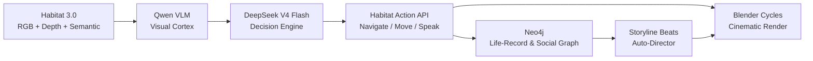

# Lifeworld

[](LICENSE)
[](./deploy/)
[]()

> **NPCs that perceive, decide, remember, and get rendered.**

Lifeworld builds autonomous SMPL-X humanoid NPCs that live lives in simulated 3D environments. Habitat 3.0 provides the world, DeepSeek provides the mind, Neo4j provides the memory, and Blender provides the render — all wired end-to-end with zero retargeting.



## Features

| Feature | Description |
|---|---|
| **End-to-End Pipeline** | Perceive → Decide → Navigate → Remember → Render — one continuous loop |
| **SMPL-X Throughout** | Same pose tensor drives Habitat simulation AND Blender render. Zero retargeting |
| **Habitat 3.0** | Real indoor scenes (ReplicaCAD), physics-correct locomotion, virtual sensors |
| **DeepSeek Mind** | V4 Flash reasons over VLM captions to choose actions and dialogue |
| **Neo4j Memory** | Persistent life-record: steps, utterances, feelings, social graph, storylines |
| **Cinematic Render** | Blender Cycles renders selected story beats at film quality |
| **Multi-Agent Society** | Multiple humanoids co-present, conversing, with seeded conflict |
| **Documentary Pipeline** | Auto-director selects story beats for final film production |
| **Dockerized** | All milestones validated on V100 (sm_70), headless, in Docker |

## Architecture

| Layer | Tech | Role |
|---|---|---|
| **Mind** | DeepSeek V4 Flash + local Qwen VLM | perceive → remember → reflect → plan → act → speak |
| **World** | Habitat 3.0 (V100, headless) | SMPL-X humanoids, navigation, virtual sensors, real indoor scenes |
| **Memory** | Neo4j | persistent life-record, social graph, storylines, events |
| **Render** | sampl SMPL-X → Blender Cycles | film-quality render of selected moments |
| **Splat** | Gaussian splatting tools | scene capture and reconstruction |
| **Docupipe** | Documentary production pipeline | research → script → narration → music → final cut |

See [`docs/ARCHITECTURE.md`](docs/ARCHITECTURE.md) for a deep dive.

## Milestones

| Milestone | What | Status |
|---|---|---|
| **M1** Embodiment | SMPL-X humanoid navigates ReplicaCAD; RGB+depth+semantic sensors | Working |
| **M2** Mind loop | Perceive → DeepSeek decides → navigate → log Neo4j | Working |
| **M3** Society | Personas + seeded conflict → DeepSeek storyline + FEELS graph | Working |
| **M3** Embodied | Two humanoids co-present + logged conversation | Working |
| **Capstone** | Neo4j storyline line → lip-synced SMPL-X clip | Working |

## Quick Start

```bash
# 1. Clone and configure
git clone https://github.com/jajmangold/lifeworld.git
cd lifeworld
cp .env.example .env
# Edit .env — set NEO4J_PASSWORD and DEEPSEEK_API_KEY

# 2. Launch
docker compose up mind

# 3. Verify
# Mind loop starts processing Habitat observations
# Check Neo4j at http://localhost:7474 for life-record entries
```

See `deploy/` for the full docker-compose configuration.

## Repo Layout

```
docs/            architecture, decisions, runbooks
world/           Habitat integration (env, sensors, humanoid driver)
mind/            agent cognition (brain client, memory, perception, planner)
memory/          Neo4j schema + access layer
render/          bridge to the sampl SMPL-X → Blender cinematic pipeline
splat/           Gaussian splatting tools
docupipe/        documentary production pipeline
deploy/          docker-compose + per-service Dockerfiles
```

## Principle

**Stay in SMPL-X space.** Body shape, pose, hands, and face are always SMPL-X. No second skeleton, ever. The same pose tensor drives the Habitat humanoid and the Blender render — zero retargeting.

## Contributing

1. Fork the repo
2. Create a feature branch
3. Make changes and add tests
4. Run `docker compose up mind` to verify
5. Open a PR

See [`docs/ARCHITECTURE.md`](docs/ARCHITECTURE.md) for the design source of truth.

## License

MIT — see [`LICENSE`](LICENSE).
